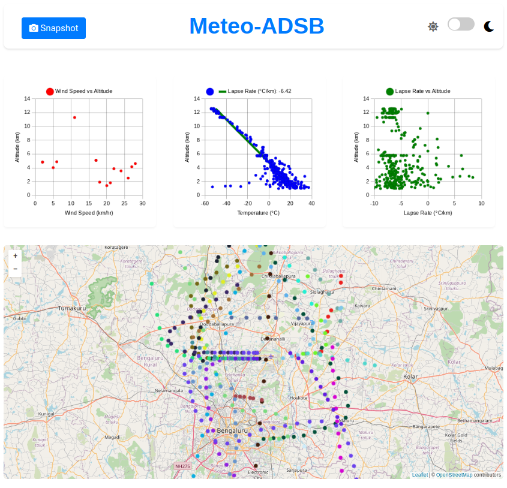
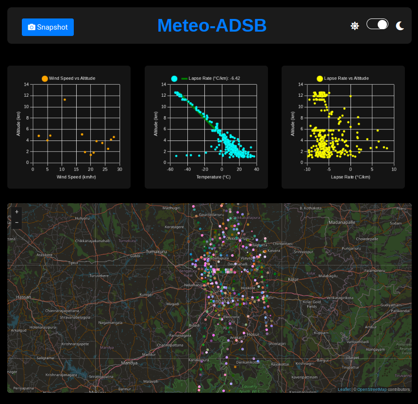

# Meteo-ADSB

Meteo-ADSB is a web application that visualizes meteorological data collected from aircraft. The application displays various charts and a map to provide insights into wind speed, temperature, and pressure at different altitudes.




## Features

- **Wind Speed vs Altitude**: Displays wind speed data against altitude.
- **Temperature vs Altitude**: Displays temperature data against altitude with an approximated lapse rate line.
- **Altitude vs Pressure**: Displays pressure data against altitude in hPa (hectopascals).
- **Map Visualization**: Displays aircraft positions on a map with unique colors for each aircraft.

## Installation

### Clone the Repository

1. Open your terminal or command prompt.
2. Clone the repository using the following command:
    ```sh
    git clone https://github.com/carbform/meteo_adsb.git
    ```
3. Navigate to the project directory:
    ```sh
    cd meteo_adsb
    ```

### Choose Your Installation Method

#### Method 1: Using Python (Cross-Platform)

1. Ensure Python 3 is installed:
    - For Windows, download and install Python from [python.org](https://www.python.org/downloads/).
    - For macOS, Python 3 is pre-installed. You can also use Homebrew to install it: `brew install python3`.
    - For Linux, use your package manager to install Python 3.

2. Run the Python script to configure the source directory for JSON data:
    ```sh
    python3 meteo_adsb.py -i
    ```

3. Start the local server:
    ```sh
    python3 meteo_adsb.py -r
    ```
    This will start a local server on port 5050, which is accessible at `http://DEVICE_LOCAL_IP:5050`.

#### Method 2: Using Shell Script (Linux/macOS)

1. Make the `meteo_adsb.sh` script executable:
    ```sh
    chmod +x meteo_adsb.sh
    ```

2. Run the installation script to configure the source directory for JSON data:
    ```sh
    sudo ./meteo_adsb.sh -i
    ```

3. Start the local server:
    ```sh
    sudo ./meteo_adsb.sh -r
    ```
    This will start a local server on port 5050, which is accessible at `http://DEVICE_LOCAL_IP:5050`.


## Methodology

### Lapse Rate Calculation

The lapse rate is calculated as the rate of change of temperature with respect to altitude. It is computed using the following formula:

$$
\text{Lapse Rate} = \frac{\Delta T}{\Delta Z}
$$

where:
- \( \Delta T \) is the change in temperature (°C)
- \( \Delta Z \) is the change in altitude (km)

### Pressure Calculation

The pressure at a given altitude is calculated using the barometric formula. For altitudes up to 11,000 meters, the formula is:

$$
P = P_b \left(1 + \frac{L \cdot h}{T_b}\right)^{\frac{-g}{L \cdot R}}
$$

For altitudes above 11,000 meters, the formula is:

$$
P = P_{11km} \cdot \exp\left(\frac{-g \cdot (h - 11000)}{R \cdot T_{11km}}\right)
$$

where:
- \( P \) is the pressure at altitude \( h \) (Pa)
- \( P_b \) is the sea level standard atmospheric pressure (101325 Pa)
- \( L \) is the lapse rate (°C/m)
- \( h \) is the altitude (m)
- \( T_b \) is the sea level standard temperature (288.15 K)
- \( g \) is the standard gravity (9.80665 m/s²)
- \( R \) is the universal gas constant for air (287.05 J/(kg·K))
- \( P_{11km} \) is the pressure at 11,000 meters
- \( T_{11km} \) is the temperature at 11,000 meters

## Contributing

Contributions are welcome! Please fork the repository and submit a pull request with your changes.

## License

This project is licensed under the MIT License. See the [LICENSE](LICENSE) file for details.

## Acknowledgements

- [OpenStreetMap](https://www.openstreetmap.org/) for map tiles.
- [Chart.js](https://www.chartjs.org/) for charting library.
- [Leaflet](https://leafletjs.com/) for interactive maps.
- [SweetAlert2](https://sweetalert2.github.io/) for alert messages.
