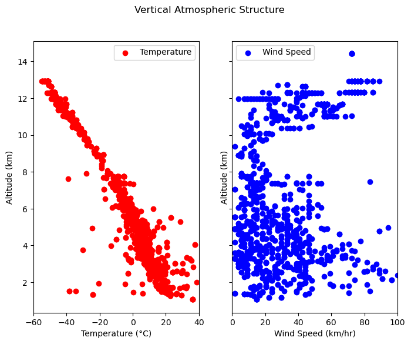

# Meto-ADSB 

## Vertical Atmospheric Structure Analysis 



This Python code plots the vertical atmospheric structure as plots between Altitude and Temperature, Altitude vs. wind speed and Altitude vs Wind Direction using data collected from the [dump1090-fa](https://www.flightaware.com/adsb/piaware/install) ADSB decoder. The calculations are similar to those used in the [tar1090](https://github.com/wiedehopf/tar1090) package.

### Python packages required

To run the code, you will need to install the following Python packages:

* `pandas`
* `numpy`
* `matplotlib.pyplot`
* `glob`
* `json`

The code reads the JSON data from `dump1090-fa/*.json` files and calculates the following meteorologic parameters:

* Wind Speed (WS)
* Wind Direction (WD)
* Outside Air Temperature (OAT)
* Total Air Temperature (TAT)

The code then plots the vertical atmospheric structure using the matplotlib.pyplot library.

To run the code, save it as a Python file (e.g. `vertical_structure.py`) and run it in the terminal using the following command:

**Usage**
* Locate the aircraft.json/history_x.json files from the dump1090-fa logs. Or else, get started with the files provided in the dump1090-fa folder in this repository. 

* When using a custom location containing the .json files, edit the 

```
json_files = glob.glob('path_to_folder/*.json')
``` 

line in the vertical_structure.py file and specify the location of the folder containing those files.


* To run the code, save it as a Python file (e.g. `vertical_structure.py`) and run it in the terminal using the following command:

```
$ python vertical_structure.py
```

The code will generate two plots:

* Altitude vs. temperature
* Altitude vs. wind speed
* Altitude vs. wind direction (yet to be implemented)

You can use these plots to analyze the vertical atmospheric structure in the area where the data was collected. For example, you can look at how the temperature, wind speed, and wind direction change with altitude.

* How to interpret the plots

Altitude vs. temperature: The temperature generally decreases with altitude. However, there can be inversions, where the temperature increases with altitude. Inversions can trap pollutants and can make it difficult for aircraft to take off and land.

Altitude vs. wind speed: The wind speed generally increases with altitude. However, there can be low-level winds, which are caused by surface friction which can be used to understand the planetary boundary layer.

Altitude vs. wind direction: The wind direction can vary with altitude. This is because the wind is affected by the Earth's rotation and by the presence of mountains and other obstacles.
Applications

* Use Cases

<span style="color:red">* Dislcaimer: The calculated data may not be accurate. The results must analyzed qualitatively.</span>