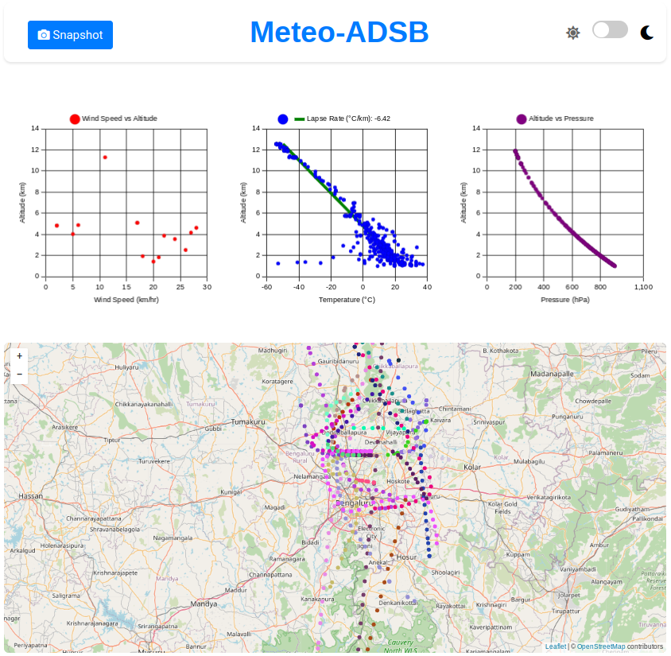
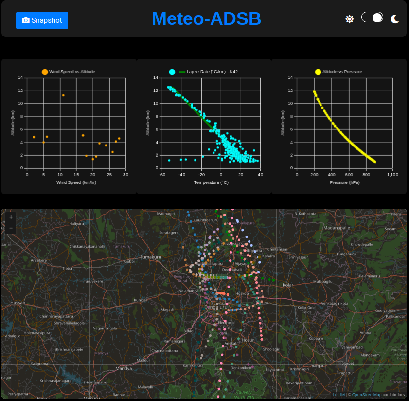

# Meteo-ADSB

Meteo-ADSB is a web application that visualizes meteorological data collected from aircraft. The application displays various charts and a map to provide insights into wind speed, temperature, and pressure at different altitudes.




## Features

- **Wind Speed vs Altitude**: Displays wind speed data against altitude.
- **Temperature vs Altitude**: Displays temperature data against altitude with an approximated lapse rate line.
- **Altitude vs Pressure**: Displays pressure data against altitude in hPa (hectopascals).
- **Map Visualization**: Displays aircraft positions on a map with unique colors for each aircraft.

## Installation

1. Clone the repository:
    ```bash
    git clone https://github.com/carbform/meteo_adsb.git
    cd meteo_adsb
    ```

## Usage

### Bash Script

To run the bash script, use the following command:

```bash
./meteo_adsb.sh [-d] [-h]
```

Options:
- `-d` : Run in demo mode. JSON files will not be copied.
- `-h` : Show help message and exit.

### Python Script

To run the Python script, use the following command:

```bash
python3 meteo_adsb.py [-d] [-r] [-i]
```

Options:
- `-d` : Run in demo mode. JSON files will not be copied.
- `-r` : Prompt for remote setup details.
- `-i` : Interactive mode to prompt for setup details.

### Example

To run the script in demo mode:

```bash
./meteo_adsb.sh -d
```

or

```bash
python3 meteo_adsb.py -d
```

## Configuration

The configuration is stored in a JSON file (`config.json` for the bash script and `meteo_adsb_config.json` for the Python script). The script will prompt for necessary details if they are not already configured.

## Accessing the Visualization

Once the server is started, you can access the visualization in your web browser at `http://<your_local_ip>:8000`.

## Methodology

### Lapse Rate Calculation

The lapse rate is calculated as the rate of change of temperature with respect to altitude:

$$
Lapse Rate (\lambda) = \frac{\Delta T}{\Delta Z}
$$

where:
- \$$( \Delta T )$$ is the change in temperature (°C)
- \$$( \Delta Z )$$ is the change in altitude (km)

### Pressure Calculation

The pressure at a given altitude is calculated using the barometric formula. For altitudes up to 11,000 meters:

$$
P = P_{b} \left(1 + \frac{\lambda \cdot h}{T_b}\right)^{\frac{-g}{\lambda \cdot R}}
$$

For altitudes above 11,000 meters:

$$
P = P_{11km} \cdot \exp\left(\frac{-g \cdot (h - 11000)}{R \cdot T_{11km}}\right)
$$

where:
- $$\( P )$$ is the pressure at altitude \( h \) (Pa)
- $$\( P_{b} )$$ is the sea level standard atmospheric pressure (101325 Pa)
- $$\( \lambda )$$ is the lapse rate (°C/m)
- $$\( h )$$ is the altitude (m)
- $$\( T_{b} )$$ is the sea level standard temperature (288.15 K)
- $$\( g )$$ is the standard gravity (9.80665 m/s²)
- $$\( R )$$ is the universal gas constant for air (287.05 J/(kg·K))
- $$\( P_{11km} )$$ is the pressure at 11,000 meters
- $$\( T_{11km} )$$ is the temperature at 11,000 meters

## Contributing

Contributions are welcome! Please fork the repository and submit a pull request with your changes.

## License

This project is licensed under the GPL V3 License. See the [LICENSE](LICENSE) file for details.

## Acknowledgements

- [OpenStreetMap](https://www.openstreetmap.org/) for map tiles.
- [Chart.js](https://www.chartjs.org/) for charting library.
- [Leaflet](https://leafletjs.com/) for interactive maps.
- [SweetAlert2](https://sweetalert2.github.io/) for alert messages.
