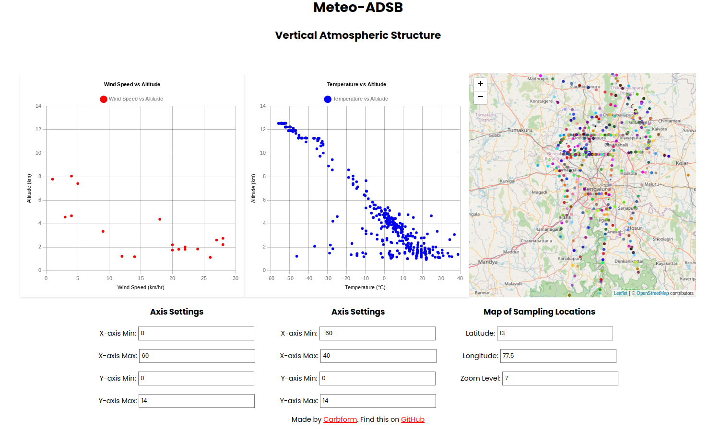

# Meteo-ADSB

## Vertical Atmospheric Structure Analysis 



Meteo-ADSB is a web application that visualizes meteorological data and aircraft data on interactive charts and maps. The application supports both light and dark modes for better visibility and user experience.

## Features

- Interactive charts displaying meteorological data
- Interactive map displaying aircraft data
- Light and dark mode toggle
- Snapshot functionality to capture charts and maps
- Responsive design for various screen sizes

## Installation

### Clone the Repository

1. Open your terminal or command prompt.
2. Clone the repository using the following command:
    ```sh
    git clone https://github.com/carbform/meteo_adsb.git
    ```
3. Navigate to the project directory:
    ```sh
    cd meteo_adsb
    ```

### Choose Your Installation Method

#### Method 1: Using Python (Cross-Platform)

1. Ensure Python 3 is installed:
    - For Windows, download and install Python from [python.org](https://www.python.org/downloads/).
    - For macOS, Python 3 is pre-installed. You can also use Homebrew to install it: `brew install python3`.
    - For Linux, use your package manager to install Python 3.

2. Run the Python script to configure the source directory for JSON data:
    ```sh
    python3 meteo_adsb.py -i
    ```

3. Start the local server:
    ```sh
    python3 meteo_adsb.py -r
    ```
    This will start a local server on port 5050, which is accessible at `http://DEVICE_LOCAL_IP:5050`.

#### Method 2: Using Shell Script (Linux/macOS)

1. Make the `meteo_adsb.sh` script executable:
    ```sh
    chmod +x meteo_adsb.sh
    ```

2. Run the installation script to configure the source directory for JSON data:
    ```sh
    sudo ./meteo_adsb.sh -i
    ```

3. Start the local server:
    ```sh
    sudo ./meteo_adsb.sh -r
    ```
    This will start a local server on port 5050, which is accessible at `http://DEVICE_LOCAL_IP:5050`.

## Usage

### Access the Web Interface

1. Open your browser and navigate to `http://DEVICE_LOCAL_IP:5050` to access the application.

### Visualizations

The webpage will generate:
- Altitude vs. Temperature plot
- Altitude vs. Wind Speed plot
- Map of Aircraft data sampling locations

You can use these plots to analyze the vertical atmospheric structure in the area where the data was collected.

### How to Interpret the Plots

- **Altitude vs. Temperature**: The temperature generally decreases with height. However, there can be inversions, where the temperature increases with altitude. Inversions can trap pollutants and cause decreased air quality. The lapse rate can also be used to study the local moisture convection.
- **Altitude vs. Wind Speed**: The wind speed generally increases with altitude. However, there can be low-level winds, which are caused by surface friction which can be used to understand the planetary boundary layer.

## Recent Additions

- **Dark Mode**: The application supports dark mode, which can be toggled using the switch in the top-right corner of the webpage.
- **Data Refresh**: The data is refreshed every 5 minutes to ensure the visualizations are up-to-date.
- **Snapshot Feature**: You can capture and save snapshots of the charts as PNG images.

## Disclaimer

The calculated data may not be accurate. The results must be analyzed qualitatively.

## License

This project is licensed under the GNU General Public License v3.0. See the [LICENSE](LICENSE) file for details.
